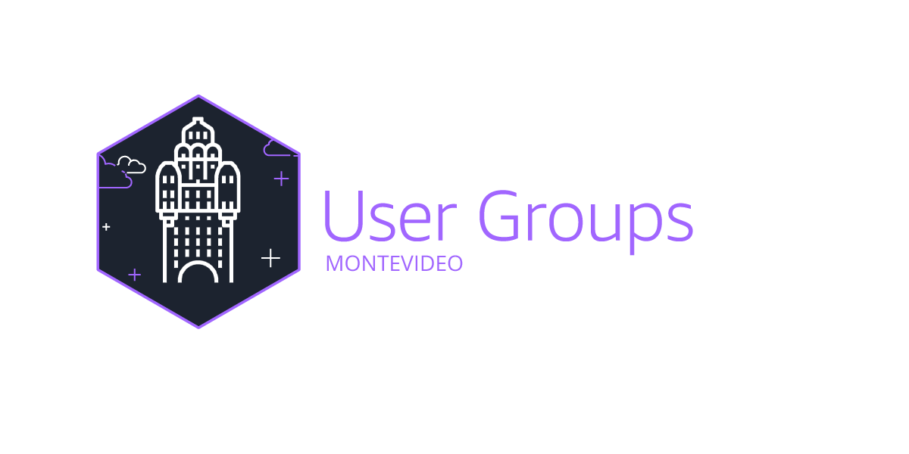

  <header style="text-align: center; padding: 20px;">
    <h1 style="margin-bottom: 10px;">Hello! 👋 I'm Gustavo Duarte</h1>
    
</header>

<main>
    <section style="margin-bottom: 20px;">
        <h2 style="color: #2ecc71; font-size: 24px; margin-bottom: 10px;">Technologies and Languages</h2>
        <ul style="font-size: 18px; list-style-type: none; padding: 0;">
            <li>React</li>
            <li>Laravel</li>
            <li>PHP</li>
            <li>Tailwind CSS</li>
            <li>Amazon Web Services (AWS)</li>
            <li>Docker</li>
            <li>Node.js</li>
        </ul>
    </section>
    <section style="margin-bottom: 20px;">
        <h2 style="color: #2ecc71; font-size: 24px; margin-bottom: 10px;">Learning</h2>
        <ul style="font-size: 18px; list-style-type: none; padding: 0;">
            <li>Kubernetes</li>
            <li>Terraform</li>
            <li>Azure</li>
        </ul>
    </section>
    <section style="margin-bottom: 20px;">
        <h2 style="color: #3498db; font-size: 24px; margin-bottom: 10px;">Certificates</h2>
        

            

                
            

        

    </section>
    <section style="margin-bottom: 20px;">
        <h2 style="color: #2ecc71; font-size: 24px; margin-bottom: 10px;">AWS UG Montevideo Community</h2>
        
I am the leader of the AWS UG Montevideo community in Uruguay. Our community is dedicated to sharing knowledge about Amazon Web Services. Join us on our social media and events!

        <ul style="font-size: 18px; list-style-type: none; padding: 0;">
            <li><a href="https://www.linkedin.com/company/aws-ug-montevideo/" target="_blank">AWS UG Montevideo</a></li>
            <li><a href="https://www.meetup.com/aws-ug-montevideo/" target="_blank">AWS UG Montevideo Meetup</a></li>
            <li><a href="https://www.youtube.com/@awsugmontevideo" target="_blank">AWS UG Montevideo on YouTube</a></li>
            <li><a href="https://instagram.com/awsugmontevideo?igshid=MzRlODBiNWFlZA==" target="_blank">AWS UG Montevideo Instagram</a></li>
        </ul>
        
        
    </section>
</main>
<footer style="background-color: #f2f2f2; padding: 20px; text-align: center;">
    
</footer>

